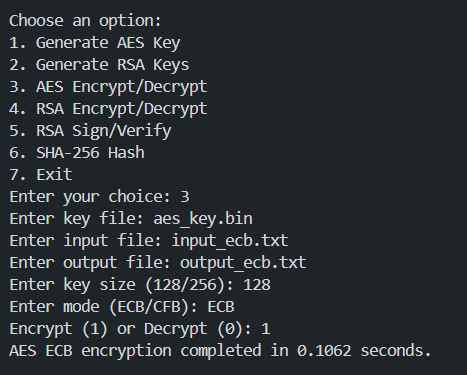

# Lab Task 4

## Solution Code

```python
# imports
import os
import time
import hashlib
from cryptography.hazmat.primitives import hashes, serialization
from cryptography.hazmat.primitives.asymmetric import rsa, padding
from cryptography.hazmat.primitives.ciphers import Cipher, algorithms, modes
from cryptography.hazmat.backends import default_backend
from cryptography.hazmat.primitives import padding as sym_padding
from cryptography.hazmat.primitives import hmac

# Generate AES key
def generate_aes_key(key_size):
    return os.urandom(key_size // 8) # key_size is in bits

# Function to generate RSA keys
def generate_rsa_keys(key_size):
    private_key = rsa.generate_private_key(
        public_exponent=65537, # Commonly used value
        key_size=key_size,
        backend=default_backend() # Use the default backend
    )
    public_key = private_key.public_key() # Extract the public key from the private key

    # Save private key. PKCS#8 is a standard format for private keys
    with open("rsa_private_key.pem", "wb") as private_file:
        private_file.write(
            private_key.private_bytes(
                encoding=serialization.Encoding.PEM,
                format=serialization.PrivateFormat.PKCS8,
                encryption_algorithm=serialization.NoEncryption()
            )
        )

    # Save public key. SubjectPublicKeyInfo is a standard format for public keys
    with open("rsa_public_key.pem", "wb") as public_file:
        public_file.write(
            public_key.public_bytes(
                encoding=serialization.Encoding.PEM,
                format=serialization.PublicFormat.SubjectPublicKeyInfo
            )
        )


# AES encryption/decryption. Supports ECB and CFB modes
def aes_encrypt_decrypt(input_file, output_file, key, mode, iv=None, encrypt=True):
    backend = default_backend() # Use the default backend
    block_size = algorithms.AES.block_size // 8 # AES block size is 128 bits

    # Set the cipher mode
    if mode == 'ECB':
        cipher_mode = modes.ECB()
    elif mode == 'CFB':
        if encrypt:
            if iv is None:
                iv = os.urandom(16)
            cipher_mode = modes.CFB(iv) # CFB mode requires an IV
        else:
            with open(input_file, 'rb') as f:
                iv = f.read(16)
                ciphertext = f.read()
            cipher_mode = modes.CFB(iv) # CFB mode requires an IV

    cipher = Cipher(algorithms.AES(key), cipher_mode, backend=backend)

    if encrypt:
        encryptor = cipher.encryptor()
        padder = sym_padding.PKCS7(block_size).padder() # PKCS7 padding

        with open(input_file, 'rb') as f:
            plaintext = f.read() # Read the plaintext

        padded_plaintext = padder.update(plaintext) + padder.finalize() # Add padding to the plaintext
        ciphertext = encryptor.update(padded_plaintext) + encryptor.finalize() # Encrypt the padded plaintext

        with open(output_file, 'wb') as f:
            if mode == 'CFB':
                f.write(iv)
            f.write(ciphertext) # Write the ciphertext to the output file
    else:
        decryptor = cipher.decryptor() # Create a decryptor
        unpadder = sym_padding.PKCS7(block_size).unpadder() # PKCS7 padding

        with open(input_file, 'rb') as f:
            if mode != 'CFB':
                ciphertext = f.read()
            # No need to re-read the file here, already read above
            # ciphertext = f.read()

        padded_plaintext = decryptor.update(ciphertext) + decryptor.finalize() # Decrypt the ciphertext
        plaintext = unpadder.update(padded_plaintext) + unpadder.finalize() # Remove padding from the plaintext

        with open(output_file, 'wb') as f:
            f.write(plaintext) # Write the plaintext to the output file


# RSA encryption/decryption. Supports encryption and decryption
def rsa_encrypt_decrypt(input_file, output_file, public_key_file, private_key_file, encrypt=True):
    if encrypt:
        with open(input_file, 'rb') as f:
            data = f.read() # Read the data to be encrypted

        # Generate AES key for encryption
        aes_key = generate_aes_key(256)  # AES-256

        with open(public_key_file, 'rb') as key_file:
            public_key = serialization.load_pem_public_key(
                key_file.read(), # Read the public key
                backend=default_backend() # Use the default backend
            )

        # Encrypt AES key with RSA public key
        encrypted_aes_key = public_key.encrypt(
            aes_key,
            padding.OAEP(
                mgf=padding.MGF1(algorithm=hashes.SHA256()),
                algorithm=hashes.SHA256(),
                label=None
            )
        )

        # Encrypt the data with AES
        iv = os.urandom(16)
        cipher = Cipher(algorithms.AES(aes_key), modes.CFB(iv), backend=default_backend()) # Use CFB mode
        encryptor = cipher.encryptor() # Create an encryptor
        ciphertext = encryptor.update(data) + encryptor.finalize() # Encrypt the data

        # Write the encrypted data to the output file
        with open(output_file, 'wb') as f:
            f.write(iv)
            f.write(encrypted_aes_key)
            f.write(ciphertext)
    else:
        with open(input_file, 'rb') as f:
            iv = f.read(16)
            encrypted_aes_key = f.read(256)  # Assuming RSA key size is 2048 bits
            ciphertext = f.read()

        with open(private_key_file, 'rb') as key_file:
            private_key = serialization.load_pem_private_key(
                key_file.read(),
                password=None,
                backend=default_backend()
            )

        # Decrypt AES key with RSA private key
        aes_key = private_key.decrypt(
            encrypted_aes_key,
            padding.OAEP(
                mgf=padding.MGF1(algorithm=hashes.SHA256()),
                algorithm=hashes.SHA256(),
                label=None
            )
        )

        # Decrypt the data with AES
        cipher = Cipher(algorithms.AES(aes_key), modes.CFB(iv), backend=default_backend()) # Use CFB mode
        decryptor = cipher.decryptor() # Create a decryptor
        plaintext = decryptor.update(ciphertext) + decryptor.finalize() # Decrypt the data

        # Write the decrypted data to the output file
        with open(output_file, 'wb') as f:
            f.write(plaintext)

# RSA signature. Supports signing and verification
def rsa_sign_verify(input_file, signature_file, private_key_file=None, public_key_file=None, sign=True):
    if sign:
        with open(private_key_file, 'rb') as key_file:
            private_key = serialization.load_pem_private_key(
                key_file.read(),
                password=None, # No password.
                backend=default_backend() # Use the default backend
            )

        with open(input_file, 'rb') as f:
            data = f.read() # Read the data to be signed

        # Sign the data with the private key
        signature = private_key.sign(
            data,
            padding.PSS(
                mgf=padding.MGF1(hashes.SHA256()),
                salt_length=padding.PSS.MAX_LENGTH
            ),
            hashes.SHA256() # Use SHA-256 for hashing
        )

        with open(signature_file, 'wb') as f:
            f.write(signature) # Write the signature to the output file
    else:
        with open(public_key_file, 'rb') as key_file:
            public_key = serialization.load_pem_public_key(
                key_file.read(), # Read the public key
                backend=default_backend()
            )

        with open(input_file, 'rb') as f:
            data = f.read()

        with open(signature_file, 'rb') as f:
            signature = f.read()

        # Verify the signature
        try:
            public_key.verify(
                signature,
                data,
                padding.PSS(
                    mgf=padding.MGF1(hashes.SHA256()), # Mask generation function
                    salt_length=padding.PSS.MAX_LENGTH # Length of the salt
                ),
                hashes.SHA256() # Use SHA-256 for hashing
            )
            print("Verification successful")
        except Exception as e:
            print("Verification failed:", e)

# SHA-256 hashing
def sha256_hash(input_file):
    sha256 = hashlib.sha256()

    with open(input_file, 'rb') as f:
        for byte_block in iter(lambda: f.read(4096), b""):
            sha256.update(byte_block)

    print("SHA-256 hash:", sha256.hexdigest()) # Print the hash in hexadecimal format

# Menu and main functionality
def main():
    while True:
        print("\nChoose an option:")
        print("1. Generate AES Key")
        print("2. Generate RSA Keys")
        print("3. AES Encrypt/Decrypt")
        print("4. RSA Encrypt/Decrypt")
        print("5. RSA Sign/Verify")
        print("6. SHA-256 Hash")
        print("7. Exit")
        choice = int(input("Enter your choice: "))

        if choice == 1:
            key_size = int(input("Enter key size (128/256): "))
            key = generate_aes_key(key_size)
            with open("aes_key.bin", "wb") as key_file:
                key_file.write(key)
            print(f"AES key of size {key_size} bits generated and saved as 'aes_key.bin'.")
        elif choice == 2:
            key_size = int(input("Enter key size: "))
            generate_rsa_keys(key_size)
            print(f"RSA keys of size {key_size} bits generated and saved as 'rsa_private_key.pem' and 'rsa_public_key.pem'.")
        elif choice == 3:
            key_file = input("Enter key file: ")
            input_file = input("Enter input file: ")
            output_file = input("Enter output file: ")
            key_size = int(input("Enter key size (128/256): "))
            mode = input("Enter mode (ECB/CFB): ")
            encrypt = int(input("Encrypt (1) or Decrypt (0): "))

            with open(key_file, "rb") as f:
                key = f.read()

            iv = None
            if mode == "CFB" and encrypt:
                iv = os.urandom(16)
                print("IV generated for CFB mode.")

            start_time = time.time()
            aes_encrypt_decrypt(input_file, output_file, key, mode, iv, encrypt)
            end_time = time.time()
            print(f"AES {mode} {'encryption' if encrypt else 'decryption'} completed in {end_time - start_time:.4f} seconds.")
        elif choice == 4:
            public_key_file = input("Enter public key file: ")
            private_key_file = input("Enter private key file: ")
            input_file = input("Enter input file: ")
            output_file = input("Enter output file: ")
            encrypt = int(input("Encrypt (1) or Decrypt (0): "))

            start_time = time.time()
            rsa_encrypt_decrypt(input_file, output_file, public_key_file, private_key_file, encrypt)
            end_time = time.time()
            print(f"RSA {'encryption' if encrypt else 'decryption'} completed in {end_time - start_time:.4f} seconds.")
        elif choice == 5:
            private_key_file = input("Enter private key file: ")
            public_key_file = input("Enter public key file: ")
            input_file = input("Enter input file: ")
            signature_file = input("Enter signature file: ")
            sign = int(input("Sign (1) or Verify (0): "))

            start_time = time.time()
            rsa_sign_verify(input_file, signature_file, private_key_file, public_key_file, sign)
            end_time = time.time()
            print(f"RSA {'signing' if sign else 'verification'} completed in {end_time - start_time:.4f} seconds.")
        elif choice == 6:
            input_file = input("Enter input file: ")
            start_time = time.time()
            sha256_hash(input_file)
            end_time = time.time()
            print(f"SHA-256 hashing completed in {end_time - start_time:.4f} seconds.")
        elif choice == 7:
            break
        else:
            print("Invalid choice!")

# Run the main function
if __name__ == "__main__":
    main()
```

## Output

### the output of the code is as follows:


<br><br>

### generate AES key:
if I choose option 1, it will ask me to enter the key size (128/256) and then it will generate the AES key of the given size and save it as 'aes_key.bin'.


<br><br>

### generate RSA keys:
if I choose option 2, it will ask me to enter the key size and then it will generate the RSA keys of the given size and save them as 'rsa_private_key.pem' and 'rsa_public_key.pem'.


<br><br>

### AES Encryption (CFB mode):
if I choose option 3, it will ask me to enter the key file, input file, output file, key size (128/256), mode (ECB/CFB), and encrypt (1) or decrypt (0). If I choose to encrypt in CFB mode, it will generate an IV for the encryption process. It will then perform AES encryption/decryption and save the output to the output file. It will also display the time taken for the operation. input file and output file were given as 'input.txt' and 'output.txt' respectively in the same directory.


input.txt:
```plaintext
Hello, I am Fahad Pathan.
```

output.txt:
```plaintext
]��	FDSf����KBckoD�.u��󸗈
```

<br><br>

### AES Decryption (CFB mode):
Here, I gave the output of the previous AES encryption as the input file for decryption. The output of the decryption is the same as the input file of the encryption.


<br><br>

### AES Encryption (ECB mode):
if I choose option 3, it will ask me to enter the key file, input file, output file, key size (128/256), mode (ECB/CFB), and encrypt (1) or decrypt (0). If I choose to encrypt in ECB mode, it will not generate an IV for the encryption process. It will then perform AES encryption/decryption and save the output to the output file. It will also display the time taken for the operation. input file and output file were given as 'input_ecb.txt' and 'output_ecb.txt' respectively in the same directory.



input_ecb.txt:
```plaintext
Hello, I am Fahad Pathan.
```

output_ecb.txt:
```plaintext
gזב&F�Z×)��¥¶;»©�Kk-��-ל
=ךh
```

<br><br>

### AES Decryption (ECB mode):
Here, I gave the output of the previous AES encryption as the input file for decryption. The output of the decryption is the same as the input file of the encryption.


<br><br>

### RSA Encryption:
if I choose option 4, it will ask me to enter the public key file, private key file, input file, output file, and encrypt (1) or decrypt (0). It will then perform RSA encryption/decryption and save the output to the output file. It will also display the time taken for the operation. input file and output file were given as 'input_rsa.txt' and 'output_rsa.txt' respectively in the same directory.


input_rsa.txt:
```plaintext
Hello, I am Fahad Pathan.
```

output_rsa.txt:
```plaintext
�������#�7�@q�[��"�������S���س��)�I�Eؒţ�+}�D�w�[ŪQ�w�O�~T���
��IfWC6�[��H)�
��7|�7�B�O�{����E�
```

<br><br>

### RSA Decryption:
Here, I gave the output of the previous RSA encryption as the input file for decryption. The output of the decryption is the same as the input file of the encryption.


<br><br>

### RSA Sign:
if I choose option 5, it will ask me to enter the private key file, public key file, input file, signature file, and sign (1) or verify (0). It will then perform RSA signing/verification and save the signature to the signature file. It will also display the time taken for the operation. input file and signature file were given as 'input.txt' and 'sign.txt' respectively in the same directory.


input.txt:
```plaintext
Hello, I am Fahad Pathan.
```

sign.txt:
```plaintext
\zO�Πό«ΪHz%p«®’ς£�η�ΩΣ;k†,.οΏFjmΞ�y/"P5όeΎi1pL·1Η@΄Diύ”ΙgΡPuκ²Ο�”�'βƒF 3i8;Vχ¤[³ΰ�gι¤lΔEΦ^¤›s_Θd³"7	�mΛ�sΐΫεPz–�\ρ�ιΒ®='t=;ψ±„ΦΟιoa‘δΪYb†')΅.«ΩHΛ±ΣΞ†›³Σnςά^oEI|Ώ
%ΐ�—-¤Μq―ρI�7„°xJ­�–'—�ςh'Ώzΐαθό!¶Ζ@��aΓ��L’�ylU5ζ„µηzEάfΖ©γ›Αp[
```

<br><br>

### RSA Verify:
Here, I gave the output of the previous RSA signing as the input file for verification. The output of the verification is "Verification successful".


<br><br>

### SHA-256 Hash:
if I choose option 6, it will ask me to enter the input file. It will then perform SHA-256 hashing and display the hash value. input file was given as 'input.txt' in the same directory.


<br><br>

### Tutorials:
- [tutorialspoint.com - Python Cryptography](https://www.tutorialspoint.com/cryptography_with_python/index.htm)
- [cryptography.io - Python Cryptography](https://cryptography.io/en/latest/)
- [YouTube - Cryptography full course](https://www.youtube.com/watch?v=j_8PLI_wCVU)
- [Laurent Luce's Blog - Python Cryptography](https://www.laurentluce.com/posts/python-and-cryptography-with-pycrypto/)

<hr>